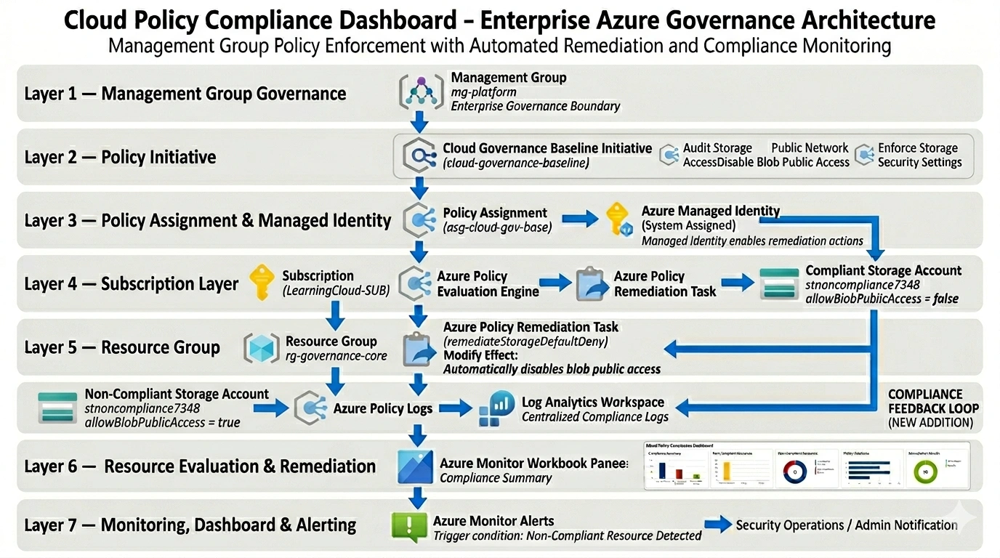

# Cloud Policy Compliance Dashboard

Enterprise-style Azure governance platform that enforces policy compliance, performs automated remediation, and visualizes resource compliance across an Azure environment using Infrastructure as Code.

---

## Architecture Overview



---

## Project Summary

The **Cloud Policy Compliance Dashboard** demonstrates how Azure Policy can be used to enforce governance controls at scale, automatically remediate insecure configurations, and provide centralized compliance visibility.

This solution deploys governance policies at the **Management Group level**, evaluates resource compliance across subscriptions, remediates violations automatically, and visualizes results using Azure Monitor Workbooks.

---

## Key Objectives

* Enforce governance policies across Azure environments
* Detect non-compliant resources automatically
* Remediate insecure configurations
* Centralize compliance logging
* Visualize compliance using dashboards
* Trigger alerts when violations occur

---

## Technologies Used

* Azure Policy
* Azure Management Groups
* Azure Monitor
* Log Analytics Workspace
* Azure Monitor Workbooks
* Azure Monitor Alerts
* Managed Identity
* Bicep
* Azure CLI

---

## Core Features

### Policy Enforcement

Azure Policy initiatives enforce security controls including:

* Disabling public blob access
* Auditing public network exposure
* Enforcing secure storage settings

Policies are deployed at the **Management Group scope**, ensuring consistent governance.

---

### Automated Remediation

Non-compliant resources are corrected automatically using:

* Azure Policy **Modify** effects
* System-assigned Managed Identity
* Policy remediation tasks

---

### Compliance Monitoring

Compliance data is collected using:

* Azure Policy logs
* Log Analytics Workspace
* Azure Monitor Workbooks

Dashboards provide real-time compliance visibility.

---

### Alerting

Azure Monitor Alerts detect policy violations and trigger administrative notifications.

---

## Architecture Layers

1. Management Group Governance
2. Policy Definitions and Initiative
3. Policy Assignment with Managed Identity
4. Subscription and Resource Group Layer
5. Resource Evaluation and Remediation
6. Monitoring and Visualization
7. Alerting and Notifications

---

## 📷 Deployment Evidence

Deployment screenshots are stored in:

```text
docs/screenshots/
```

These include:

* Policy compliance states
* Remediation execution
* Workbook dashboards
* Alert notifications
* CLI validation outputs

---

## 🌐 Live Project Walkthrough

Architecture Overview:
https://oowusu.com/cloud-policy-compliance-dashboard.html

Technical Deep Dive:
https://oowusu.com/cloud-policy-compliance-dashboard-deepdive.html

---

## Deployment Approach

Infrastructure was deployed using **Bicep modules** to enable consistent and repeatable governance configuration across Azure environments.

---

## earning Outcomes

* Azure governance implementation
* Policy-based remediation workflows
* Infrastructure as Code using Bicep
* Azure Monitor and Log Analytics integration
* Workbook dashboard creation
* Azure CLI automation

---

## License

MIT License
